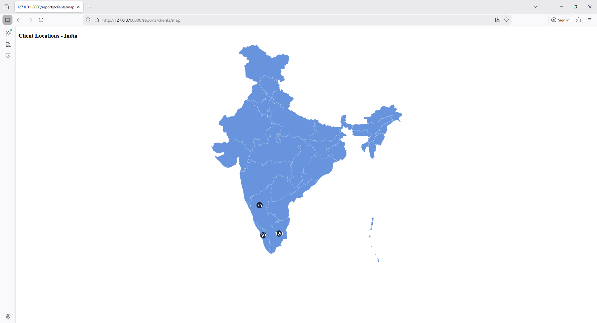

# Laravel Blade – India Client Map (State Wise Count)

```bash
php artisan make:controller ReportController
```

```php
<?php

namespace App\Http\Controllers;

use Illuminate\Http\Request;

class ReportController extends Controller
{
    public function map()
    {
        $stateClients = [
            [
                "state"=>"Tamil Nadu",
                "value"=>120,
                "geometry"=>[
                    "type"=>"Point",
                    "coordinates"=>[78.6569,11.1271]
                ]
            ],
            [
                "state"=>"Karnataka",
                "value"=>75,
                "geometry"=>[
                    "type"=>"Point",
                    "coordinates"=>[75.7139,15.3173]
                ]
            ],
            [
                "state"=>"Kerala",
                "value"=>50,
                "geometry"=>[
                    "type"=>"Point",
                    "coordinates"=>[76.2711,10.8505]
                ]
            ]
        ];

        return view('backend.reports.clients.map',compact('stateClients'));
    }
}
```

# 3️⃣ Blade File

`resources\views\backend\reports\clients\map.blade.php`

```php
@extends('adminlte::page')

@section('title', 'CP Clients')

@section('content')

<style>
#chartdiv{
    width:100%;
    height:700px;
}
</style>

<div class="container">
    <h3>Client Locations - India</h3>
    <div id="chartdiv"></div>
</div>

<script src="https://cdn.amcharts.com/lib/5/index.js"></script>
<script src="https://cdn.amcharts.com/lib/5/map.js"></script>
<script src="https://cdn.amcharts.com/lib/5/geodata/indiaLow.js"></script>
<script src="https://cdn.amcharts.com/lib/5/themes/Animated.js"></script>

<script>

am5.ready(function(){

var root = am5.Root.new("chartdiv");

root.setThemes([
    am5themes_Animated.new(root)
]);

// Map chart
var chart = root.container.children.push(
    am5map.MapChart.new(root,{
        projection: am5map.geoMercator(),
        panX:"rotateX",
        panY:"translateY"
    })
);


// India polygons
var polygonSeries = chart.series.push(
    am5map.MapPolygonSeries.new(root,{
        geoJSON: am5geodata_indiaLow
    })
);

polygonSeries.mapPolygons.template.setAll({
    tooltipText:"{name}"
});

polygonSeries.mapPolygons.template.states.create("hover",{
    fill: am5.color(0x297373)
});


// ----------------------------
// CLIENT DATA FROM LARAVEL
// ----------------------------

var stateData = @json($stateClients);


// Point Series
var pointSeries = chart.series.push(
    am5map.MapPointSeries.new(root,{
        valueField:"value"
    })
);


// Bubble
pointSeries.bullets.push(function(root,dataItem){

    var container = am5.Container.new(root,{});

    var circle = container.children.push(
        am5.Circle.new(root,{
            radius:10,
            fill:am5.color(0x000000),
            fillOpacity:0.7,
            tooltipText:"{state}\nClients: [bold]{value}[/]"
        })
    );

    var label = container.children.push(
        am5.Label.new(root,{
            text:"{value}",
            fill:am5.color(0xffffff),
            centerX:am5.p50,
            centerY:am5.p50,
            populateText:true
        })
    );

    return am5.Bullet.new(root,{
        sprite:container
    });

});


// Set Data
pointSeries.data.setAll(stateData);

});

</script>

@endsection
```

`web.php`
```php
use App\Http\Controllers\ReportController;

Route::get('/reports/clients/map', [ReportController::class, 'map']);
```



# Result

Map will show:

🇮🇳 **India Map**

Each state shows:

```
● Tamil Nadu    120
● Karnataka     75
● Kerala        50
```

Hover Tooltip:

```
Tamil Nadu
Clients: 120
```
