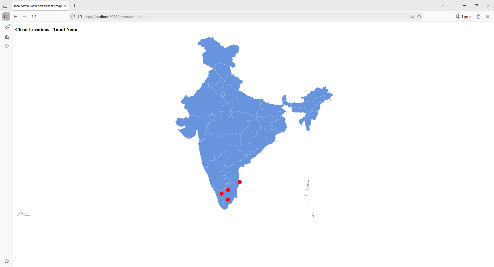

```bash
php artisan make:controller ReportController
```

```php
<?php

namespace App\Http\Controllers;

use Illuminate\Http\Request;

class ReportController extends Controller
{
    public function map()
    {
        $clients = [
            ["name"=>"Client A","city"=>"Chennai","lat"=>13.0827,"long"=>80.2707],
            ["name"=>"Client B","city"=>"Coimbatore","lat"=>11.0168,"long"=>76.9558],
            ["name"=>"Client C","city"=>"Madurai","lat"=>9.9252,"long"=>78.1198],
            ["name"=>"Client D","city"=>"Salem","lat"=>11.6643,"long"=>78.1460],
        ];

        return view('backend.reports.clients.map',compact('clients'));
    }
}
```

# 3️⃣ Blade File

`resources\views\backend\reports\clients\map.blade.php`

```php
@extends('layouts.app')

@section('content')

<style>
#chartdiv{
    width:100%;
    height:700px;
}
</style>

<div class="container">
    <h3>Client Locations - Tamil Nadu</h3>
    <div id="chartdiv"></div>
</div>

<script src="https://cdn.amcharts.com/lib/5/index.js"></script>
<script src="https://cdn.amcharts.com/lib/5/map.js"></script>
<script src="https://cdn.amcharts.com/lib/5/geodata/indiaLow.js"></script>
<script src="https://cdn.amcharts.com/lib/5/themes/Animated.js"></script>

<script>

var clients = @json($clients);

am5.ready(function(){

var root = am5.Root.new("chartdiv");

root.setThemes([
    am5themes_Animated.new(root)
]);

var chart = root.container.children.push(
    am5map.MapChart.new(root,{
        panX:"rotateX",
        projection: am5map.geoMercator()
    })
);


var polygonSeries = chart.series.push(
    am5map.MapPolygonSeries.new(root,{
        geoJSON: am5geodata_indiaLow
    })
);

polygonSeries.mapPolygons.template.setAll({
    tooltipText:"{name}"
});

polygonSeries.mapPolygons.template.states.create("hover",{
    fill: am5.color(0x297373)
});


var pointSeries = chart.series.push(
    am5map.MapPointSeries.new(root,{
        valueField:"value"
    })
);


pointSeries.bullets.push(function(root,dataItem){

    var container = am5.Container.new(root,{});

    var circle = container.children.push(
        am5.Circle.new(root,{
            radius:8,
            fill:am5.color(0xff0000),
            tooltipText:"{name} ({city})"
        })
    );

    circle.events.on("click",function(ev){

        var data = ev.target.dataItem.dataContext;

        alert("Client : "+data.name+"\nCity : "+data.city);

    });

    return am5.Bullet.new(root,{
        sprite:container
    });
});


var data = [];

clients.forEach(function(client){

    data.push({
        geometry:{
            type:"Point",
            coordinates:[client.long,client.lat]
        },
        name:client.name,
        city:client.city
    });

});

pointSeries.data.setAll(data);

});

</script>

@endsection
```

`web.php`
```php
use App\Http\Controllers\ReportController;

Route::get('/reports/clients/map', [ReportController::class, 'map']);
```
