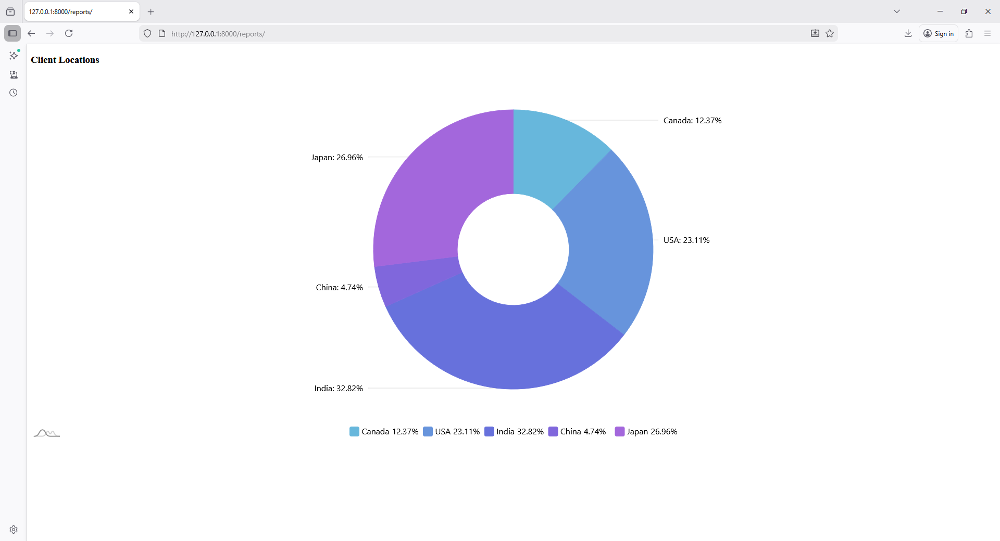

```bash
php artisan make:controller ReportController
```

```php
<?php

namespace App\Http\Controllers;

use Illuminate\Http\Request;

class ReportController extends Controller
{
    public function index(Request $request)
    {
        return view('backend.reports.index');
    }
    public function getUser(Request $request)
    {
        $data = [
            [
                "country" => "Cannda",
                "visits" => "321"
            ],
            [
                "country" => "USA",
                "visits" => "600"
            ],
            [
                "country" => "India",
                "visits" => "852"
            ],
            [
                "country" => "China",
                "visits" => "123"
            ],
        ];

        // return response()->json([
        //     'data' => $data
        // ]);

        return response()->json([
            [
                "country" => "Canada",
                "visits" => 321
            ],
            [
                "country" => "USA",
                "visits" => 600
            ],
            [
                "country" => "India",
                "visits" => 852
            ],
            [
                "country" => "China",
                "visits" => 123
            ],
            [
                "country" => "Japan",
                "visits" => 700
            ]
        ]);
    }
}
```

# 3️⃣ Blade File

`resources\views\backend\reports\index.blade.php`

```php
@extends('layouts.app')

@section('content')

<style>
#chartdiv{
    width:100%;
    height:700px;
}
</style>

<div class="container">
    <h3>Client Locations</h3>
    <div id="chartdiv"></div>
</div>


<script src="https://cdn.amcharts.com/lib/5/index.js"></script>
<script src="https://cdn.amcharts.com/lib/5/percent.js"></script>
<script src="https://cdn.amcharts.com/lib/5/themes/Animated.js"></script>

<script>
am5.ready(function () {

    var root = am5.Root.new("chartdiv");

    root.setThemes([
        am5themes_Animated.new(root)
    ]);

    var chart = root.container.children.push(
        am5percent.PieChart.new(root, {
            layout: root.verticalLayout,
            innerRadius: am5.percent(40)
        })
    );

    var series = chart.series.push(
        am5percent.PieSeries.new(root, {
            valueField: "visits",
            categoryField: "country"
        })
    );

    // Legend
    var legend = chart.children.push(
        am5.Legend.new(root, {
            centerX: am5.percent(50),
            x: am5.percent(50)
        })
    );

    // 🔄 Load Data Function
    function loadData() {
        fetch("/ajax/getuser")
            .then(res => res.json())
            .then(data => {
                series.data.setAll(data);
                legend.data.setAll(series.dataItems);
                console.log("Updated at:", new Date().toLocaleTimeString());
            })
            .catch(err => console.error(err));
    }

    // Initial load
    loadData();

    // 🔄 Auto refresh every 5 seconds
    setInterval(loadData, 5000);

});
</script>

@endsection
```

`web.php`
```php
use App\Http\Controllers\ReportController;

Route::get('/reports', [ReportController::class, 'index']);

Route::get('/ajax/getuser', [ReportController::class, 'getUser']);
```
